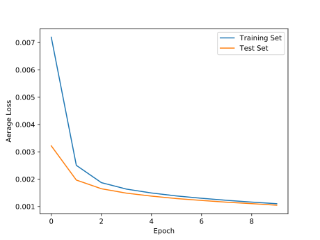
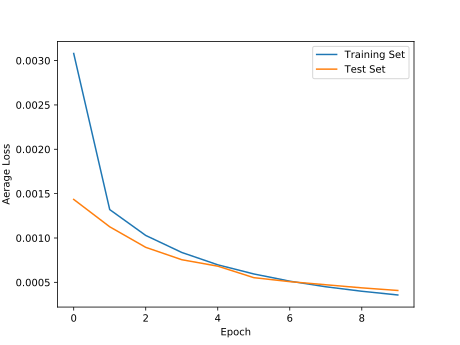
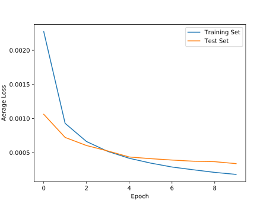
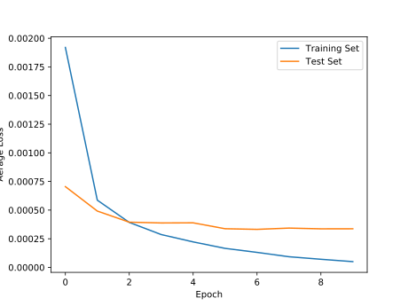
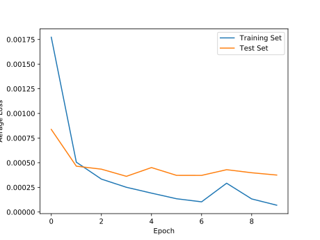
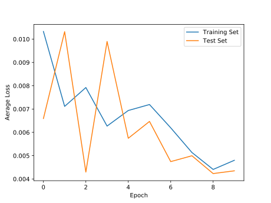
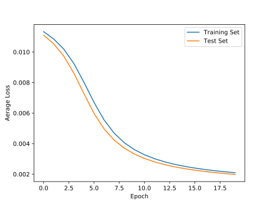
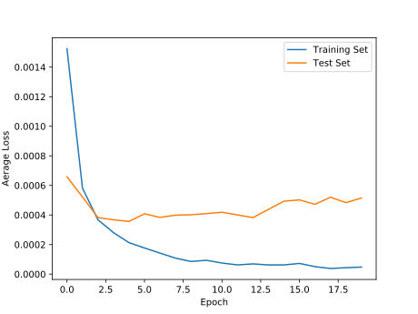
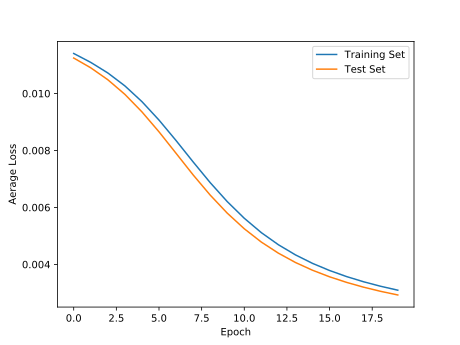

# Exam Prerequisite - KI in der Robotik

- [Overview](#Overview)
- [Installation Guide](#Installation-Guide)
- [Theoretical Background](#Theoretical-Background)
    - [Robot Operating System](Robot-Operating-System)
    - [Neural Networks](Neural-Networks)
- [Implementation](#Implementation)
    - [Main Program](#Main-Program)
    - [Model Training](#Model-Training)
- [Findings](#Findings)

# Overview

This program serves as an exam prerequisite for the module "KI in der Robotik" at the HTW Berlin. It implements a ROS application that predicts handwritten digits on images. This is achieved using a fully connected neural network which trained on the MNIST dataset.

# Installation Guide

This guide was tested on Ubuntu 20.04. Adapt package names and file locations to your OS. You have to have a ROS Noetic environment (at least the ros-noetic-ros-base package) and a catkin workspace already setup. The ROS setup scripts (e.g. /opt/ros/noetic/setup.bash and workspace/devel/setup.bash) have to be sourced. Python3 needs to be installed.

1. Copy the folder this file is in into the "src" directory of your catkin workspace.
2. Install the following necessary python modules and catkin packages if needed: torch, torchvision, python3-opencv, python3-matplotlib and ros-noetic-cv-bridge. This can be done manually or preferably by using rosdep (python3-rosdep package, requires python3-pip): "sudo rosdep init && rosdep update && rosdep install ros_ai_task".
3. Execute "catkin_make" in the root directory of your catkin workspace to build the program.
4. Execute "python3 ../src/ros_ai_task/model_training.py" from "src/ros_ai_task/model" to train the MNIST model.
5. Execute "roslaunch ros_ai_task task.launch" to start the program and terminate it with Ctrl+C.

# Theoretical Background

## Robot Operating System

ROS (Robot Operating System) is an open-source meta operating system. It runs on top of Unix based systems and provides abstraction over process management, low-level communication and hardware. It also provides tools and libraries to develop applications in the field of robotics and distributed systems. ROS is build on the concept of creating a (possibly distributed) peer-to-peer network of nodes. A node is a single, modular process that should perform a dedicated task, which is implemented using C++ (roscpp) or Python (rospy). All nodes register themselfs at the ROS master, which serves as a nameserver and processer manager to the rest of the network. Nodes communicate which each other using ROS messages, which are data structures that define the type of data that is passed. The communication is usually based on ROS topics, which implement an asynchronous publish-subscribe pattern so that nodes are truly decoupled. If direct, synchronous communication with an immediate response is needed, ROS services can be used.

## Neural Networks

Neural networks are a emulation of a human brain with inter-connected nodes (neurons) with weighted edges (synapses). The learning part comes from the process of altering each weight after each evaluation to better map inputs to their expected outputs. This is called supervised learning and inputs with known outputs have to be available for that. The type of neural network used here is called a fully connected, feed forward network which consists of one input layer, one hidden layer and one output layer. Each node of one layer connects to each node on the following layer. During the forward pass, the data passes through the network while the weights are applied. To achieve non-linear mappings, an activation function is applied to inputs between each layer. After that, the error to the expected value is calculated with a predefined loss function and the weights are updated accoring to a predefined optimizer in a process called back-propagation. The process is repeated for a certain number of epochs so that the output gets closer and closer to the expected value. Ater the training, the model can be used on unknown input.

# Implementation

## Main Program

 The image above shows the structure of the network. The "camera" node picks one of the MNIST images at random, converts it to an image message using the "cv_bridge" package and sends it to the "processor" node. There, the incoming image is converted to a 8 bit, single channel black and white image and resized to 28x28 pixels before being sent to the "controller" node. The "controller" node also receives the number on the image from the "camera" node, which was extracted from the file name and is being used for validation. Synchronization on both messages is done using a "TimeSynchronizer", which uses the timestamp on each message for synchronization. The "controller" sends the processed image to the "ai" node, which is sadly not shown on the graph above as a ROS service was used for communication. The "ai" node transforms the data to a range between 0 and 1 before predicting the number with the previously trained MNIST model and sending the prediction and its probability back to the "controller" node. As the prediction comes in the form of a vector of probabilities for each number, the highest one is chosen. It is then validated with the previsouly obtained number. The process is repeated indefinitely.

## Model Training

Model training is done on the MNIST dataset, which gets automatically downloaded if needed. The data is shuffled and split into batches for faster processing. The network itself is a fully connected, 3 layer, feed forward network with a input for every pixel on the image and an output for every possible number. The activation function between the layers is called "ReLU", which maps linearly for positive values and returns 0 for negative ones. On the output, a "Log SoftMax" function is applied, so that each output value represents the logarithm of the probability of being a certain number. This is a requirement for the loss function "NLLLoss", which is often used in multi-class classification problems together with the optimizer "Adadelta". The model is trained for 10 epochs and tested after each epoch on a dedicated test dataset. The average loss for each epoch is calculated and then saved as a graph. The trained model itself is also saved.

# Findings

The following graphs look at the loss over time for the following learning rates with the SGD optimizer: 0.01, 0.05, 0.1, 0.3, 0.5, 0.8.

0.01|0.05|0.1
---|---|---
 |  | 

0.3|0.5|0.8
---|---|---
 |  | 

They archieved the following success percentages after 10 epochs: 94%, 97.6%, 97.8%, 98.1%, 98.1%, 59.8%. With this relativly small training time, higher training rates archieve the best results. They aproach their best performance at very early epochs and grow relativly stable after that. This is true up to a learning rate of 0.5, where results seem to start varying.

The following graphs look at the loss over time for the following optimizer: SGD, Adam, Adadelta. The learning rate is reduced to 0.001 as this seems to be the default for most optimizers and the epoch count is increased to 20 so that the final result is comparable.

SGD|Adam|Adadelta
---|---|---
 |  | 

The success percentages were 89.1%, 98.0%, 86.6%. Learning rates seem to be not comparable accross optimizers. On the tested lower learning rate, Adam performs really well immediatly while SGD and Adadelta apraoch pretty linearly and don´t get the same success percentage. Previous experiments show the same performance of SGD on higher learning rates.

The highest success rate during testing was archieved with Adadelta with the default starting learning rate of 1.0. It predicted 9851 from 10000 (98.5%) numbers correctly after 20 epochs. As it also adapts its learning rate on its own during training and improves that way over SGD with a fixed learning rate, it is chosen as the optimizer for this network.
